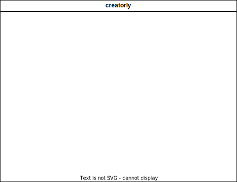

# Architecture

## Overview

Creatorly is a application, which makes the creation of projects easier. The application reads from a template project or from a template folder and creates a project folder from it.

## Level 1 - Whitebox creatorly

## Level 2 - Whitebox application